<strong><h3 style="font-family:'Exo';cursor:pointer;text-decoration: none;text-align:center;">MyWeatherApp:sunny::zap::snowflake:</h3></strong>


MyWeatherApp - simple weather forecast application based on data provided  by ***[Open Weather Map][1]*** and ***[OpenStreetMap][2]*** API's.

Goal was to create web application with minimalistic design, capable of sending weather reports on the following day via email and displaying info on map. 
This App was developed as final project for [CS50's Web programing][3] course.

---
#### Features and detales

* Every day weather reports via email :e-mail:
* Weather info on map(3 hour step due to free API key) :globe_with_meridians:
* Weather data caching :package:

App is based on Flask framework, Postgresql DB.  Mailing is preformed using smtplib, note that current default send time is 5:00 am UTC. Application provides visual info about cloud coverage, precipitation, temperature by placing particular layers over map using [Leaflet][4] library. Aside from account credentials storage, postgres is used to store cache, thus diminishing number of calls to the OWM API.

#### Here is [live demo][5]

<details><summary style="cursor:pointer;">hint</summary>

To start tracking:

  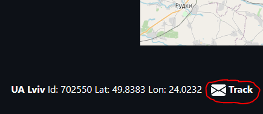

To stop tracking:

  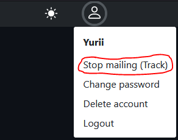

</details>

---
#### Set up on local machine

<details><summary style="cursor:pointer;">Steps:</summary>

#### Step 1

First you would need to set up DB, use Docker for that.
After cloning repo via git ```git clone https://github.com/qwerith/Weather-Project``` use following comands:

  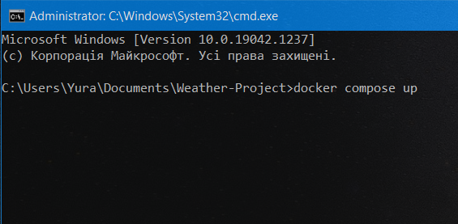

After container has been composed, open pg admin in the browser, log in

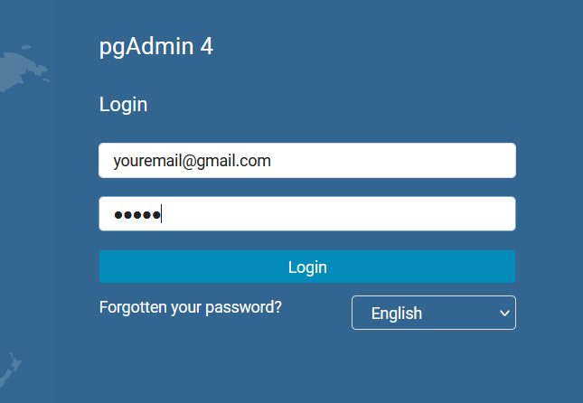

(default credentials are ```yuriisorokin98@gmail.com``` and ```weatherapp```)

Create server

  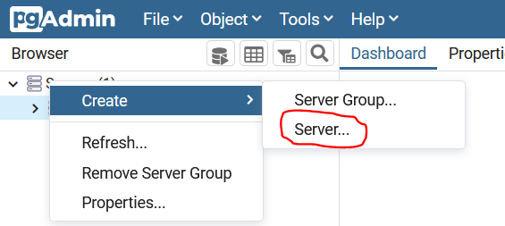

  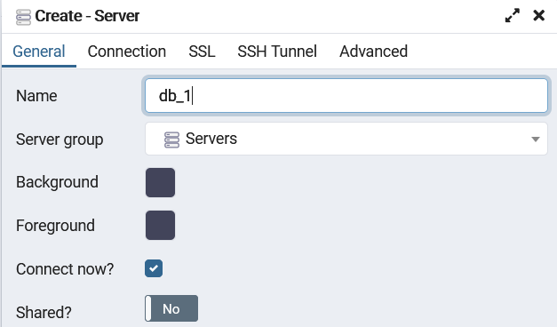

On Linux and macOS host name ```localhost``` should work fine, on Windows following steps should be done:  
```docker ps``` than ```docker inspect``` + postgres container id


  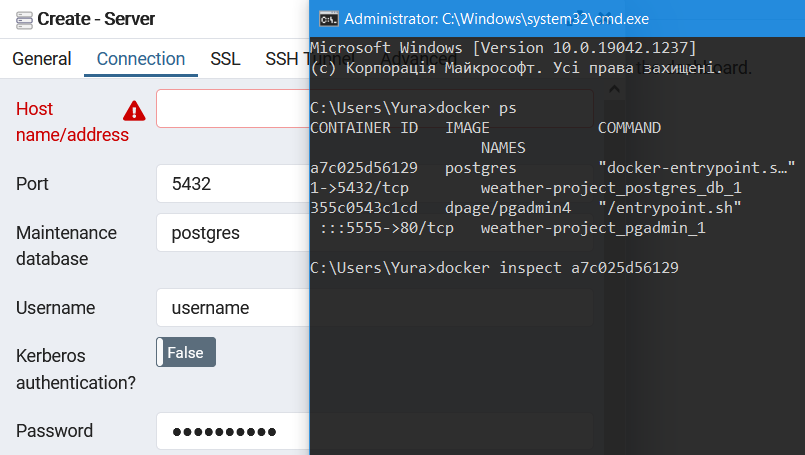


Host name should == to ```"IPAddress"``` value.

  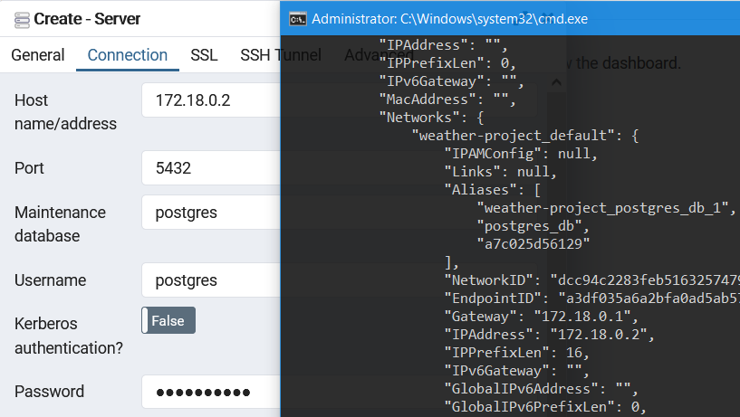


Username should be changed to ```postgres```
Default password == ```weatherapp```

Open query tool and paste contents of ```SQL.txt``` file from ```Weather_project``` folder, run to create DB tables.

  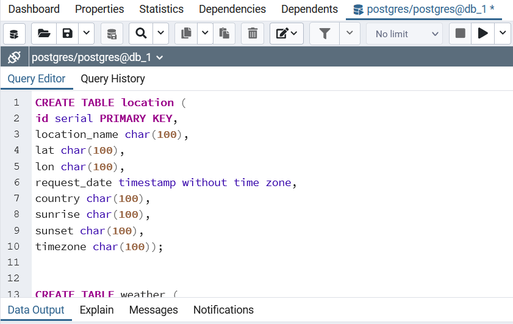

#### Step 2
Install dependencies

  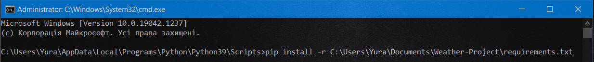
  
Note that path to requirements.txt will be different!

#### Step 3
Create ```.env``` file in your ```Weather_project``` folder and set up next credentials:

  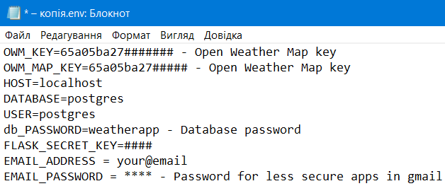
  
Note that FLASK_SECRED_KEY can be omitted!

#### Step 4
Launch app.py file, you may need to start flask with this commands:
Bash = ```$ export FLASK_APP=app```
```$ flask run```

CMD = ```> set FLASK_APP=app```<br>```> flask run```

Powershell = ```> $env:FLASK_APP = "app"```<br>```> flask run```
</details>

#### Future scope
- Add dressing adviser :snowflake: == :coat: :scarf: :gloves:
- Improve mail messages :incoming_envelope:
- Add localization :ukraine:


[1]: (https://openweathermap.org)
[2]: (https://www.openstreetmap.org)
[3]: (https://cs50.harvard.edu/web/2020)
[4]: (https://leafletjs.com)
[5]: (https://qweatherapp.herokuapp.com)

#### Attributions:
Original code snippet for Leaflet set up with OWM was made by [Godnik](https://github.com/owm-inc/VANE-intro/blob/master/apps/leaflet-owm.html) is licensed by [MIT](https://opensource.org/licenses/MIT)
Original code snippet for login/register page was made by [Syanaputra]("https://bootsnipp.com/syanaputra")
